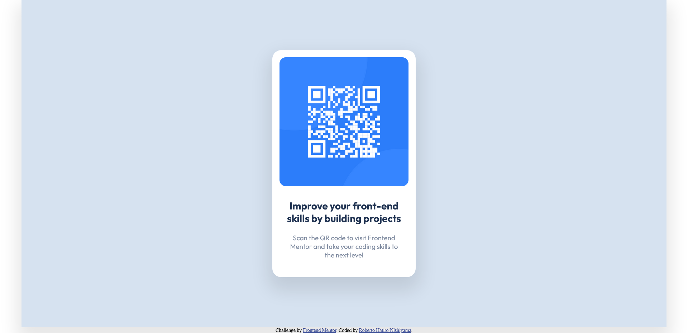

# Frontend Mentor - QR code component solution

This is a solution to the [QR code component challenge on Frontend Mentor](https://www.frontendmentor.io/challenges/qr-code-component-iux_sIO_H). Frontend Mentor challenges help you improve your coding skills by building realistic projects.

## Table of contents

- [Overview](#overview)
  - [Screenshot](#screenshot)
  - [Links](#links)
- [My process](#my-process)
  - [Built with](#built-with)
  - [What I learned](#what-i-learned)
- [Author](#author)

## Overview

### Screenshot

<div>
  
  
</div>

### Links

- Solution URL: [https://github.com/rhatiro/frontendmentor.io-01_QR-code-component](https://github.com/rhatiro/frontendmentor.io-01_QR-code-component)
- Live Site URL: [https://rhatiro.github.io/frontendmentor.io-01_QR-code-component/](https://rhatiro.github.io/frontendmentor.io-01_QR-code-component/)

## My process

### Built with

- Semantic HTML5 markup
- CSS custom properties
- Flexbox

### What I learned

This was my first challenge to build this QR code component and make it as close to the design as possible.

While simple, I had the opportunity to broaden my knowledge and practice while building the repository based on the challenge instructions and linking the GitHub Pages hosted site to the repository's main page.

Regarding the structuring of the content with HTML and the styling of the design with CSS, I was able to remember some forgotten concepts and acquire new learnings such as:

- Apply external `font-family` in CSS using `<link>` tag in HTML;

```html
<link rel="preconnect" href="https://fonts.googleapis.com" />
<link rel="preconnect" href="https://fonts.gstatic.com" crossorigin />
<link
  href="https://fonts.googleapis.com/css2?family=Outfit:wght@400;700&display=swap"
  rel="stylesheet"
/>
```

```css
font-family: "Outfit", sans-serif;
```

- Adapt the design to different screen sizes setting CSS media queries;

```css
@media (max-width: 768px) {
  main {
    max-width: 375px;
    min-width: 320px;
  }
}
```

- And use some css properties like `box-sizing` and `box-shadow`.

```css
box-sizing: border-box;
box-shadow: 0 20px 40px 10px rgba(0, 0, 0, 0.1);
```

## Author

- Frontend Mentor - [@rhatiro](https://www.frontendmentor.io/profile/rhatiro)
